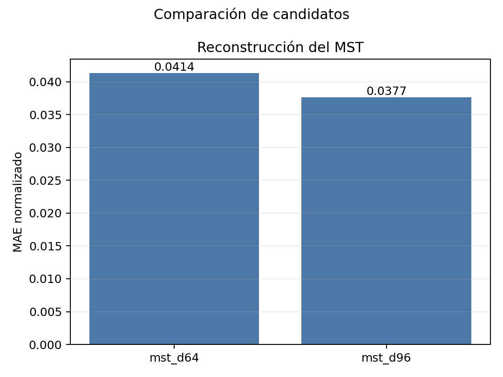
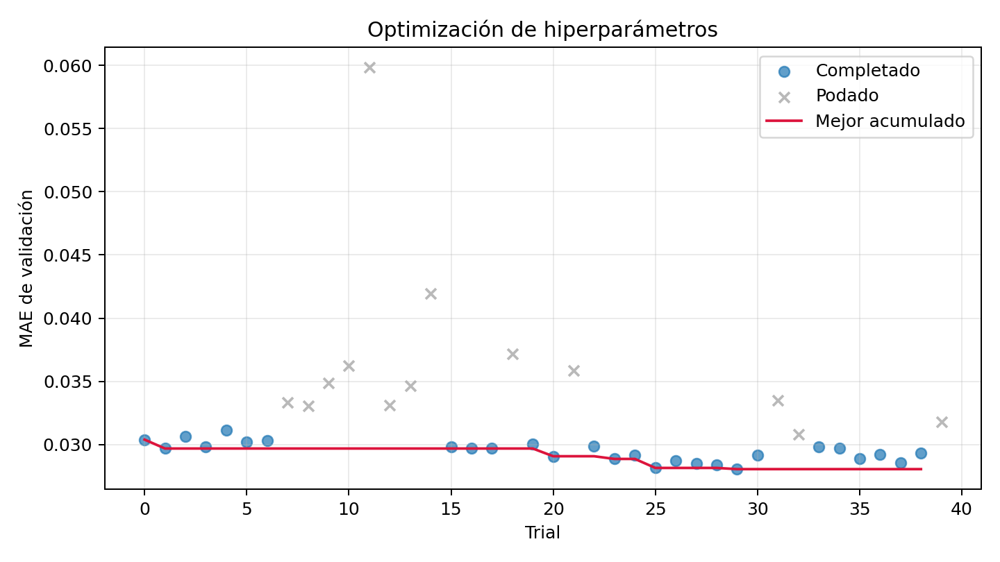
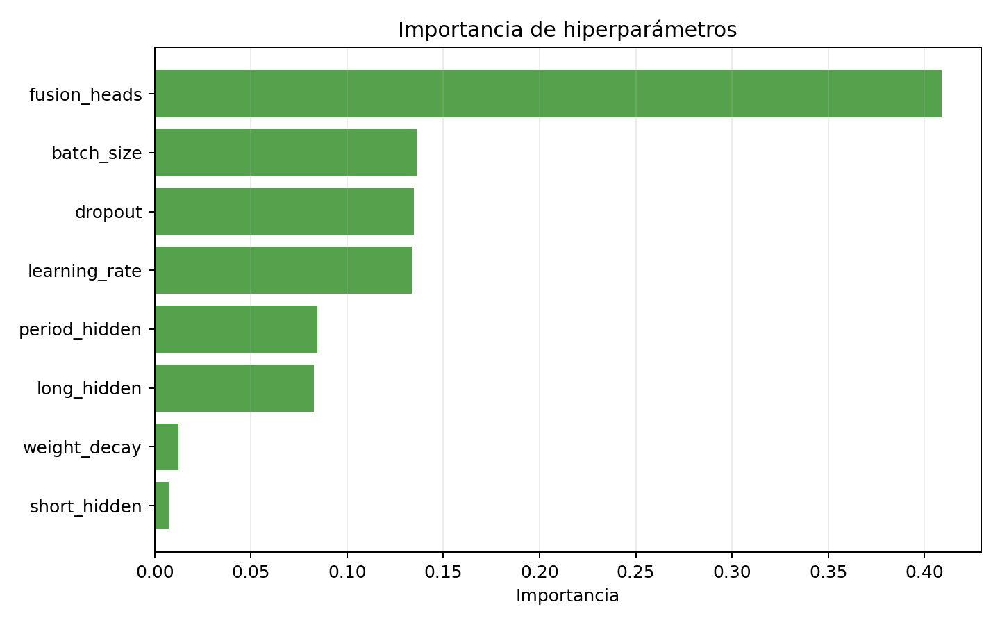
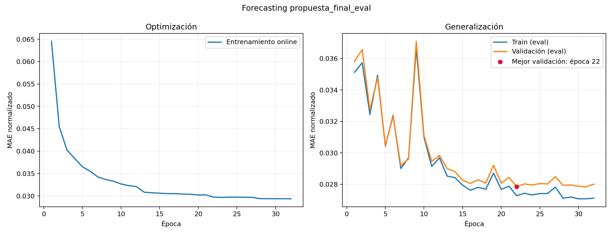
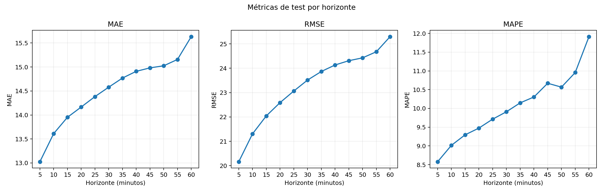
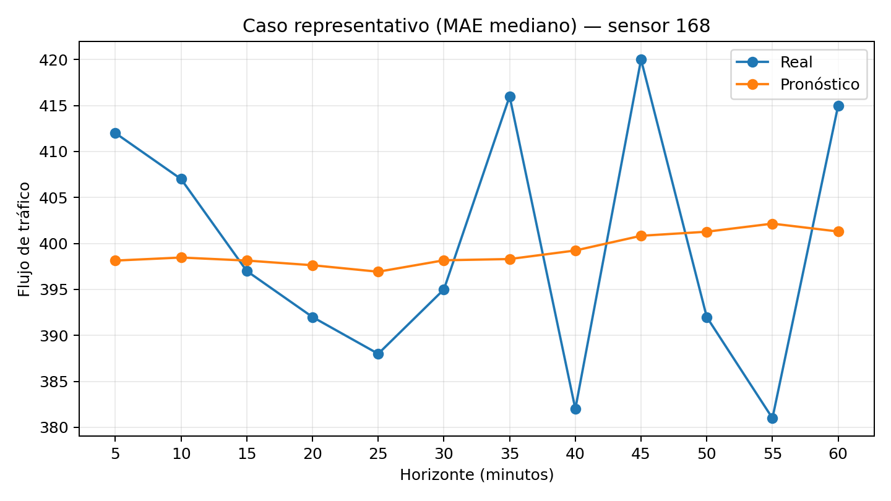
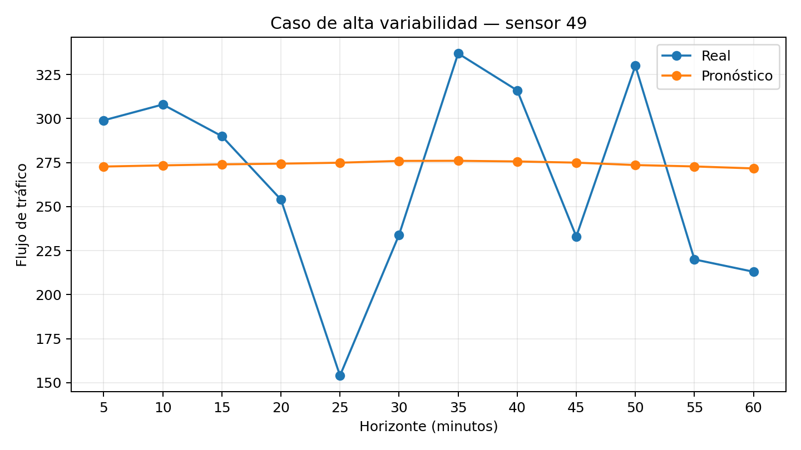

# LSTTN-PEMS08: representación temporal y forecasting espaciotemporal

Este repositorio implementa y evalúa una **variante inspirada en
[LSTTN](https://arxiv.org/abs/2403.16495)** para pronosticar flujo
de tráfico en PEMS08. El proyecto combina aprendizaje autosupervisado sobre una semana histórica,
modelado espacial mediante grafos y extracción temporal de corto y largo plazo.

La pregunta experimental principal es:

> ¿Una representación temporal de 96 dimensiones aprendida mediante reconstrucción enmascarada
> produce mejores pronósticos que una representación de 64 dimensiones y qué configuración de
> forecasting aprovecha mejor esa representación?

No es una reproducción exacta del LSTTN publicado. Se conservan PEMS08, los splits oficiales, la
idea de preentrenar un Masked Subseries Transformer (MST), el Transformer congelado y las ramas
espaciotemporales, pero se usa una semana de contexto y una implementación modular propia. Por ello,
la comparación con el paper es **referencial**.

## Estado del experimento

Estado al 2 de julio de 2026:

| Fase | Estado | Resultado principal |
|---|---|---|
| Preparación de PEMS08 y grafo | Completa | 17 856 pasos, 170 sensores, splits oficiales |
| Pretraining MST-64 y MST-96 | Completa | MST-96 reduce el MAE de reconstrucción en 8.93 % |
| Probes de forecasting | Completa | MST-96 reduce el MAE de validación en 4.51 % |
| Optuna sobre MST-96 | Completa | 40 trials; trial 29 ganador |
| Entrenamiento final | Completa | MAE global 14.52; MAE a 60 min 15.63 |

El modelo final fue seleccionado exclusivamente con validation; test nunca intervino en la elección
de arquitectura, hiperparámetros o época. La ejecución auditada reprodujo exactamente el checkpoint,
las predicciones y las métricas de la primera ejecución final.

## Visión de alto nivel

El flujo completo es:

```text
PEMS08 + grafo de sensores
          │
          ├── Pretraining MST-64 ─┐
          └── Pretraining MST-96 ─┤ reconstrucción enmascarada
                                  ↓
                       comparación en validación
                                  ↓
               probes de forecasting con MST congelado
                                  ↓
                       ganador: MST-96 congelado
                                  ↓
                Optuna sobre módulos de forecasting
                                  ↓
                 entrenamiento final con early stopping
                                  ↓
                   evaluación única sobre el conjunto test
```

El **pretraining** enseña al Transformer a representar patrones temporales. El **forecasting** usa
esas representaciones, junto con información reciente, diaria, semanal y espacial, para estimar los
12 pasos siguientes. Congelar el Transformer significa que sigue calculando representaciones para
cada muestra, pero sus parámetros no cambian durante forecasting.

## Dataset y construcción de muestras

### PEMS08 utilizado por el código

| Propiedad | Valor |
|---|---:|
| Pasos temporales | 17 856 |
| Sensores | 170 |
| Características almacenadas | 3 |
| Intervalo | 5 minutos |
| Horizonte de salida | 12 pasos = 60 minutos |
| Contexto largo | 2 016 pasos = 1 semana |
| Contexto corto | 12 pasos = 1 hora |
| Grafo cargado | `dataset/sensor_graph/adj_mx_08.pkl` |
| Entradas no nulas de la adyacencia cargada | 548 |

Las tres características de `data.pkl` son flujo normalizado, posición dentro del día y día de la
semana. Las ramas larga, diaria y semanal usan flujo. Graph WaveNet recibe las dos primeras
características: flujo y posición diaria.

El flujo viene normalizado aproximadamente en `[-1, 1]`. Los archivos oficiales indican mínimo 0
y máximo 1077, por lo que para una diferencia absoluta:

```text
MAE en unidades originales = MAE normalizado × (1077 - 0) / 2
                           = MAE normalizado × 538.5
```

Esta conversión se usa solo para interpretar pérdidas normalizadas de validación. Las métricas
finales de test se calculan después de aplicar la transformación inversa.

### Entradas de forecasting para un instante `t`

| Tensor | Intervalo | Uso |
|---|---|---|
| `x_short` | `[t-12, t)` | Última hora, rama Graph WaveNet |
| `x_long` | `[t-2016, t)` | Semana completa, Transformer y tendencia larga |
| `x_day` | `[t-300, t-288)` | Hora correspondiente del día anterior |
| `x_week` | `[t-2028, t-2016)` | Hora correspondiente de la semana anterior |
| `target` | `[t, t+12)` | Flujo futuro de 5 a 60 minutos |

Las ventanas se construyen de manera perezosa; no se materializan copias masivas en RAM. Los
valores no finitos se imputan con medias calculadas usando únicamente el tramo de entrenamiento.

### Splits efectivos

Se leen `train_index.pkl`, `valid_index.pkl` y `test_index.pkl`. Solo se descartan índices que no
tienen la historia necesaria:

| Split | Índices originales | Pretraining (historia ≥ 2016) | Forecasting (historia ≥ 2028) |
|---|---:|---:|---:|
| Train | 10 700 | 8 696 | 8 684 |
| Validation | 3 567 | 3 567 | 3 567 |
| Test | 3 566 | No se usa | 3 566 |

Test queda excluido de pretraining, selección de arquitectura y Optuna. Solo se consulta después
de seleccionar hiperparámetros y entrenar el modelo final.

## Arquitectura

### 1. Masked Subseries Transformer

Cada semana de cada sensor se divide en 168 patches de una hora:

```text
2016 pasos / 12 pasos por patch = 168 tokens temporales
```

Durante pretraining se oculta aleatoriamente el 75 %: 126 patches enmascarados y 42 visibles. Los
tokens visibles pasan por un encoder Transformer de 4 capas. Una capa Transformer adicional actúa
como decoder: reúne estados visibles y tokens máscara en la secuencia completa y reconstruye solo
los patches ocultos mediante una cabeza lineal. La pérdida es L1.

Se compararon dos candidatos que solo cambian la dimensión de representación:

| Candidato | `d_model` | Capas encoder | Cabezas | Dimensión por cabeza | Parámetros MST |
|---|---:|---:|---:|---:|---:|
| `mst_d64` | 64 | 4 | 4 | 16 | 262 348 |
| `mst_d96` | 96 | 4 | 4 | 24 | 577 836 |

El encoder procesa la secuencia temporal de cada sensor de forma independiente; las relaciones
entre sensores se incorporan después en las ramas de grafo. Durante forecasting no hay máscara ni
reconstrucción: se usa el encoder sobre la semana real completa. El decoder, el token máscara y la
cabeza de reconstrucción son auxiliares de pretraining y no participan en la predicción futura.

### 2. Rama de largo plazo

El MST congelado produce un tensor `[batch, nodos, 168, d_model]`. Cuatro convoluciones 1D con
dilataciones `1, 2, 4, 8`, activación GELU y pooling comprimen la secuencia de representaciones.
Una proyección devuelve la rama al espacio de dimensión `d_model`.

### 3. Ramas periódicas diaria y semanal

Las horas de referencia diaria y semanal se codifican con el mismo embedding y encoder congelados.
Cada representación pasa por una convolución de grafo dinámica que combina:

- transición física hacia delante;
- transición física hacia atrás;
- adyacencia adaptativa aprendida;
- difusión de órdenes 1 y 2.

Las dos ramas tienen parámetros propios y luego se proyectan a `d_model`.

### 4. Rama de corto plazo

La última hora se procesa mediante una implementación local de Graph WaveNet con:

- 4 bloques y 2 capas por bloque;
- convoluciones temporales dilatadas y compuertas;
- conexiones residuales y skip;
- grafo físico directo e inverso;
- grafo adaptativo aprendido.

Esta implementación es autocontenida: el código experimental no importa módulos desde `paper/`.

### 5. Fusión y salida

`AttentionFusion` apila tendencia larga, referencia diaria y referencia semanal como tres tokens por
sensor. Una atención multi-head aprende cómo combinarlos. Su promedio contextualizado se concatena
con la rama corta y un MLP produce 12 valores futuros por sensor.

Con la configuración ganadora de Optuna, el modelo completo tiene 1 048 096 parámetros:

| Bloque | Parámetros | Entrenables en forecasting |
|---|---:|---:|
| Transformer MST-96 | 577 836 | 0 |
| Extractor y proyección larga | 21 728 | 21 728 |
| Grafos y proyecciones periódicas | 19 296 | 19 296 |
| Graph WaveNet corto y proyección | 372 104 | 372 104 |
| Atención de fusión | 37 440 | 37 440 |
| Cabeza de salida | 19 692 | 19 692 |
| **Total** | **1 048 096** | **470 260** |

## Protocolo de entrenamiento y evaluación

### Fase A: pretraining

- Datos: train y validation; test excluido.
- Optimizador: AdamW, `lr=1e-3`, sin weight decay.
- Batch: 8.
- Máximo: 100 épocas.
- Early stopping: 10 épocas sin mejora.
- AMP y clipping de gradiente a 1.0.
- Máscara de validación determinista para comparar candidatos justamente.
- Selección: menor MAE normalizado de reconstrucción en validation.

### Fase B: probes de arquitectura

Cada checkpoint MST se congela y se combina con exactamente el mismo forecasting baseline:

```json
{
  "long_hidden": 16,
  "period_hidden": 16,
  "short_hidden": 64,
  "fusion": "attention",
  "fusion_heads": 4,
  "dropout": 0.1,
  "learning_rate": 0.001,
  "weight_decay": 0.00001,
  "batch_size": 16
}
```

Los probes entrenan como máximo 20 épocas, conservan el mejor checkpoint por validation y nunca
consultan test. Su propósito es elegir la representación por utilidad predictiva, no solo por su
capacidad para reconstruir patches.

### Fase C: Optuna

Solo se optimizan los módulos de forecasting sobre MST-96 congelado. Cada trial comienza desde cero,
entrena un máximo de 20 épocas y devuelve su mejor MAE global normalizado de validation.

| Hiperparámetro | Espacio |
|---|---|
| `long_hidden` | 4, 8, 16, 32 |
| `period_hidden` | 4, 8, 16, 32 |
| `short_hidden` | 32, 64, 96, 128 |
| `fusion_heads` | 2, 4, 8 |
| `dropout` | continuo, 0.05–0.30 |
| `learning_rate` | log-uniforme, `1e-4`–`3e-3` |
| `weight_decay` | log-uniforme, `1e-6`–`1e-3` |
| `batch_size` | 8, 16, 32 |

Se usa TPE y `MedianPruner` con 5 épocas de calentamiento. Dos workers pueden compartir el mismo
estudio SQLite, pero deben tener semillas de sampler distintas; la semilla de entrenamiento permanece
en 42 para comparar configuraciones bajo las mismas condiciones.

### Fase D: forecasting final

- Transformer ganador congelado y en modo evaluación.
- Optimizador Adam sobre parámetros entrenables.
- `ReduceLROnPlateau`, paciencia 4 y factor 0.5.
- Máximo 100 épocas y early stopping de 10.
- AMP y clipping de gradiente a 3.0.
- Selección del checkpoint por MAE global de validation.
- Evaluación única en test con el checkpoint seleccionado.

La función objetivo es MAE en espacio normalizado, enmascarando objetivos cuyo flujo real es cero.
Después de invertir la escala, test reporta MAE, RMSE y MAPE globales y para cada horizonte de 5 a
60 minutos. También mantiene accesos directos a 15, 30 y 60 minutos.

## Resultados obtenidos

### Pretraining

| Candidato | Mejor época | Épocas ejecutadas | MAE normalizado | MAE original aprox. | Tiempo |
|---|---:|---:|---:|---:|---:|
| MST-64 | 73 | 83 | 0.041352 | 22.27 | 63.89 min |
| **MST-96** | **48** | **58** | **0.037658** | **20.28** | **58.11 min** |

MST-96 reduce el error de reconstrucción en 8.93 %. Las curvas de entrenamiento y validación se
mantienen próximas; el early stopping se activa diez épocas después del último mínimo en ambos casos.
El MAE de reconstrucción no es comparable con el MAE de forecasting del paper: son tareas diferentes.

### Probes de forecasting

| Transformer congelado | Mejor época | MAE validation normalizado | MAE original aprox. | Tiempo |
|---|---:|---:|---:|---:|
| MST-64 | 20 | 0.029787 | 16.04 | 15.21 min |
| **MST-96** | **17** | **0.028445** | **15.32** | 18.37 min |

MST-96 mejora 4.51 % frente a MST-64. La diferencia es menor que en reconstrucción porque el
forecasting incluye Graph WaveNet, grafos periódicos y fusión, que pueden compensar parte de la
diferencia entre representaciones. El resultado selecciona MST-96 para Optuna.



### Búsqueda Optuna autoritativa (`v2`)

`optuna_mst_d96_v1.db` corresponde a una ejecución diagnóstica descartada en la que dos workers
comenzaron con la misma semilla de sampler. El estudio válido es:

```text
resultados_modular/optuna_mst_d96_v2.db
study_name = lsttn_pems08_mst_d96_v2
```

Se ejecutaron 40 trials en dos tandas de dos GPU:

| Estado | Cantidad |
|---|---:|
| Completados | 27 |
| Podados | 13 |
| Total | 40 |

La primera tanda tardó 2 h 39 min y la segunda 2 h 46 min de tiempo de pared. La segunda tanda
permitió a TPE concentrarse en una región claramente mejor. El trial 29 fue el ganador:

```json
{
  "long_hidden": 32,
  "period_hidden": 8,
  "short_hidden": 128,
  "fusion_heads": 8,
  "dropout": 0.05187430755873573,
  "learning_rate": 0.0016348488574552506,
  "weight_decay": 0.000028629036260125473,
  "batch_size": 16,
  "fusion": "attention"
}
```

| Resultado trial 29 | Valor |
|---|---:|
| Mejor época | 16 |
| MAE validation normalizado | 0.028054 |
| MAE original aproximado | 15.11 |
| MAE al terminar la época 20 | 0.028065 |
| Mejora frente al probe MST-96 | 1.37 % |
| Mejora frente al probe MST-64 | 5.82 % |

Los cuatro mejores trials comparten `long_hidden=32`, `period_hidden=8`, `short_hidden=128`, ocho
cabezas y batch 16. El análisis fANOVA identifica `fusion_heads` como la variable más influyente,
seguida por batch size, dropout y learning rate. Esta importancia es descriptiva: solo considera los
27 trials completados y las muestras fueron elegidas adaptativamente por TPE.

El ganador usa valores máximos del espacio para `long_hidden`, `short_hidden` y `fusion_heads`, y un
dropout cercano al mínimo. Debe describirse como el mejor resultado **dentro del espacio explorado**,
no como un óptimo universal.



Los círculos muestran trials completados y las cruces, trials podados; la línea roja conserva el
mejor MAE de validation encontrado hasta cada trial completado.



## Resultados finales

El entrenamiento final usó el checkpoint MST-96 y los hiperparámetros del trial 29. La mejor
validación ocurrió en la época 22, con MAE normalizado `0.027839`; el early stopping terminó el
proceso en la época 32. Los artefactos están en:

| Medición en la época 22 | MAE normalizado |
|---|---:|
| Train online | 0.029716 |
| Train en modo evaluación | 0.027271 |
| Validation en modo evaluación | 0.027839 |

La brecha comparable entre train y validation es aproximadamente 2.08 %. La repetición que añadió
esta auditoría produjo exactamente el mismo MAE global de test (`14.515821`) que la ejecución previa,
confirmando que la medición adicional no alteró el entrenamiento.

```text
resultados_modular/forecasting/propuesta_final_eval/
├── best.pt
├── metrics.json
├── learning_curve.png
├── test_metrics_by_horizon.png
├── prediction_example.png
├── prediction_high_variability.png
└── test_predictions.npz
```

| Horizonte | MAE | RMSE | MAPE |
|---|---:|---:|---:|
| Global (12 horizontes) | 14.52 | 23.33 | 10.05 % |
| 15 min | 13.95 | 22.04 | 9.30 % |
| 30 min | 14.58 | 23.52 | 9.91 % |
| 60 min | 15.63 | 25.30 | 11.91 % |

<details>
<summary>Métricas completas de los 12 horizontes</summary>

| Horizonte | MAE | RMSE | MAPE |
|---|---:|---:|---:|
| 5 min | 13.03 | 20.16 | 8.58 % |
| 10 min | 13.61 | 21.31 | 9.01 % |
| 15 min | 13.95 | 22.04 | 9.30 % |
| 20 min | 14.17 | 22.59 | 9.47 % |
| 25 min | 14.38 | 23.06 | 9.71 % |
| 30 min | 14.58 | 23.52 | 9.91 % |
| 35 min | 14.77 | 23.87 | 10.15 % |
| 40 min | 14.91 | 24.13 | 10.30 % |
| 45 min | 14.98 | 24.31 | 10.67 % |
| 50 min | 15.03 | 24.43 | 10.57 % |
| 55 min | 15.16 | 24.68 | 10.96 % |
| 60 min | 15.63 | 25.30 | 11.91 % |

</details>





Comando para extraer únicamente el resumen que debe copiarse a la tabla:

```bash
python -c "import json; m=json.load(open('resultados_modular/forecasting/propuesta_final_eval/metrics.json')); print('validación:',m['best_valid_loss_normalized']); print(json.dumps(m['test'],indent=2))"
```

Comparación referencial publicada para LSTTN en PEMS08
([artículo](https://doi.org/10.1016/j.knosys.2024.111637),
[repositorio original](https://github.com/GeoX-Lab/LSTTN)):

| Horizonte | MAE | RMSE | MAPE |
|---|---:|---:|---:|
| 15 min | 13.17 | 20.78 | 8.63 % |
| 30 min | 13.71 | 21.89 | 9.09 % |
| 60 min | 14.54 | 23.47 | 9.77 % |

La variante queda por encima del error publicado en los tres horizontes:

| Horizonte | Diferencia MAE | Diferencia RMSE | Diferencia MAPE |
|---|---:|---:|---:|
| 15 min | +5.93 % | +6.07 % | +7.71 % |
| 30 min | +6.34 % | +7.42 % | +9.02 % |
| 60 min | +7.52 % | +7.79 % | +21.94 % |

Por tanto, el resultado no supera al LSTTN publicado. La degradación aumenta con el horizonte y es
especialmente visible en MAPE a 60 minutos. La comparación sigue siendo referencial porque cambian el
contexto histórico, varios componentes y el protocolo; no debe presentarse como una reproducción
directa. El MAE global no se compara con la tabla del paper porque allí se reportan horizontes
específicos.

### Cómo interpretar las curvas y los ejemplos

En las curvas, `train_loss` es un promedio **online**: se acumula mientras los pesos cambian durante
la época, con dropout y capas en modo entrenamiento. `valid_loss` se calcula después, con los pesos
finales de la época, dropout desactivado y el modelo en modo evaluación. Por eso validation puede ser
menor que entrenamiento sin que exista una inconsistencia. Las dos cantidades no son evaluaciones
simétricas del mismo checkpoint. En los entrenamientos finales nuevos también se registra
`train_eval_loss`: una segunda pasada sobre train, sin gradientes y en modo `eval()`. La figura final
separa optimización (`train_loss`) y generalización (`train_eval_loss` frente a `valid_loss`). Esta
medición adicional no se ejecuta en probes ni en Optuna para no encarecer la búsqueda.

En la época elegida, validation supera a train eval solo en 2.08 %. Después de ese punto, train eval
continúa bajando lentamente mientras validation se estabiliza; al detenerse en la época 32 la brecha
sigue siendo pequeña (3.29 %). No se observa una divergencia fuerte compatible con sobreajuste
severo, aunque sí el inicio esperable de una separación entre ambos conjuntos.

El antiguo `prediction_example.png` seleccionaba deliberadamente, dentro del primer ejemplo, el
sensor con mayor rango real. Era un caso de estrés y no una muestra representativa. La predicción casi
plana de ese caso muestra una limitación real: el modelo suaviza cambios bruscos y tiende hacia el
nivel medio. El código actualizado genera por separado un caso de MAE mediano
(`prediction_example.png`) y el caso de alta variabilidad (`prediction_high_variability.png`). Las
conclusiones cuantitativas deben basarse en todo test, no en una única trayectoria.





Sobre todos los valores válidos de test, la correlación entre objetivo y predicción es `0.9872`. El
sesgo medio es `+0.59` unidades; la desviación estándar predicha (`144.76`) es ligeramente menor que
la real (`146.01`), coherente con el suavizado observado en picos y valles.

### Auditoría de integridad de resultados

La fotografía versionada en `resultados_modular/` fue comprobada después de descargarla mediante Git
LFS:

| Comprobación | Resultado |
|---|---|
| Archivos versionados de resultados | 86 archivos; 78 319 718 bytes |
| JSON de métricas | 33 válidos |
| Imágenes PNG | 41 válidas |
| Estudios SQLite Optuna `v1` y `v2` | `PRAGMA integrity_check = ok` |
| Tensores finales | `(3566, 12, 170)` para objetivos y predicciones |
| Valores no finitos | Ninguno |
| Métricas recalculadas desde `test_predictions.npz` | Coinciden con `metrics.json` (diferencia máxima `3.3e-7`) |
| Primera ejecución vs. ejecución auditada | Checkpoints y predicciones idénticos por SHA-256 |
| Estado Git LFS | Sin objetos pendientes |

Los 33 JSON corresponden a dos pretrainings, dos probes, 27 trials completados y dos ejecuciones
finales. Los 13 trials podados permanecen registrados en la base SQLite y en `optuna_trials.csv`,
pero no generan un `metrics.json` final.

## Estructura del repositorio

```text
.
├── README.md                         # Documento principal del proyecto
├── run_experiment.py                 # CLI: pretrain, compare, probe, tune, train y plots
├── requirements-experiment.txt       # Dependencias salvo PyTorch/CUDA
├── dataset/
│   ├── PEMS08/                       # Datos, escala e índices oficiales
│   └── sensor_graph/adj_mx_08.pkl    # Grafo usado por el experimento
├── lsttn_experiment/
│   ├── config.py                     # Configuración común y candidatos MST
│   ├── data.py                       # Splits, ventanas perezosas, escala y grafo
│   ├── metrics.py                    # MAE enmascarado, MAE, RMSE y MAPE
│   ├── plotting.py                   # Curvas y visualizaciones
│   ├── tuning.py                     # Objetivo y estudio Optuna
│   ├── models/
│   │   ├── transformer.py            # MST, encoder, decoder y reconstrucción
│   │   ├── lsttn.py                  # Integración de todas las ramas
│   │   ├── components.py             # Dilated conv, grafo dinámico y fusión
│   │   ├── graph_wavenet.py          # Graph WaveNet autocontenido
│   │   └── short_term.py             # Adaptador de la rama corta
│   └── training/
│       ├── pretrain.py               # Pretraining autosupervisado
│       ├── forecast.py               # Entrenamiento, selección y test
│       └── common.py                 # Semillas, dispositivo y JSON
└── resultados_modular/
    ├── pretraining/                  # Checkpoints, métricas y curvas MST
    ├── forecasting/probe_*/          # Probes de selección
    ├── forecasting/trial_*/          # Trials completados
    ├── optuna_mst_d96_v2.db          # Estudio Optuna completo
    ├── optuna_trials.csv             # Tabla de los 40 trials
    ├── optuna_best.json              # Parámetros seleccionados
    └── optuna_plots/                 # Historia e importancia
```

`paper/` es solo material de referencia y está ignorado por Git. `src.py` es el script monolítico
legado, también ignorado. Ninguno es necesario para ejecutar esta implementación.

## Instalación

Entorno utilizado en servidor:

- Python 3.10.12;
- dos NVIDIA RTX A6000 de 48 GB;
- driver NVIDIA 570.207;
- PyTorch instalado dentro de un entorno virtual.

PyTorch debe instalarse por separado con un wheel compatible con el driver. Ejemplo para CUDA 12.8:

```bash
python3 -m venv .venv
source .venv/bin/activate
python -m pip install --upgrade pip
python -m pip install torch --index-url https://download.pytorch.org/whl/cu128
python -m pip install -r requirements-experiment.txt
```

Verificación:

```bash
python -c "import torch; print(torch.__version__, torch.version.cuda, torch.cuda.is_available(), torch.cuda.device_count())"
```

## Ejecución reproducible

Todos los comandos se ejecutan desde la raíz y con `.venv` activo.

### Pretraining paralelo

Ejecutar los dos primeros comandos en terminales separadas:

```bash
# Terminal 1
CUDA_VISIBLE_DEVICES=0 python run_experiment.py pretrain --candidate mst_d64 --device cuda:0

# Terminal 2
CUDA_VISIBLE_DEVICES=1 python run_experiment.py pretrain --candidate mst_d96 --device cuda:0

# Después de que ambos terminen
python run_experiment.py compare
```

### Probes paralelos

Ejecutar los dos primeros comandos en terminales separadas:

```bash
# Terminal 1
CUDA_VISIBLE_DEVICES=0 python run_experiment.py probe --candidate mst_d64 --device cuda:0

# Terminal 2
CUDA_VISIBLE_DEVICES=1 python run_experiment.py probe --candidate mst_d96 --device cuda:0

# Después de que ambos terminen
python run_experiment.py compare
```

### Optuna distribuido en dos GPU

Después de definir las variables, ejecutar cada worker en una terminal separada:

```bash
CHECKPOINT="resultados_modular/pretraining/mst_d96/best.pt"
STORAGE="sqlite:///resultados_modular/optuna_mst_d96_v2.db"
STUDY="lsttn_pems08_mst_d96_v2"

CUDA_VISIBLE_DEVICES=0 python run_experiment.py tune \
  --checkpoint "$CHECKPOINT" --device cuda:0 --trials 10 \
  --storage "$STORAGE" --study-name "$STUDY" --sampler-seed 44

CUDA_VISIBLE_DEVICES=1 python run_experiment.py tune \
  --checkpoint "$CHECKPOINT" --device cuda:0 --trials 10 \
  --storage "$STORAGE" --study-name "$STUDY" --sampler-seed 45
```

Para exportar el mejor trial sin añadir otros:

```bash
python run_experiment.py tune \
  --checkpoint "$CHECKPOINT" --device cuda:0 --trials 0 \
  --storage "$STORAGE" --study-name "$STUDY" --sampler-seed 42
```

### Entrenamiento final

```bash
CUDA_VISIBLE_DEVICES=0 python run_experiment.py train \
  --checkpoint resultados_modular/pretraining/mst_d96/best.pt \
  --params resultados_modular/optuna_best.json \
  --device cuda:0 --run-name propuesta_final_eval
```

Para mantener procesos después de cerrar SSH, anteponer `nohup`, redirigir el log y terminar con `&`:

```bash
CUDA_VISIBLE_DEVICES=0 nohup python run_experiment.py train \
  --checkpoint resultados_modular/pretraining/mst_d96/best.pt \
  --params resultados_modular/optuna_best.json \
  --device cuda:0 --run-name propuesta_final_eval \
  > logs/final_eval.log 2>&1 &
echo $! > logs/final_eval.pid
```

## Dónde encontrar y cómo interpretar resultados

| Archivo | Contenido |
|---|---|
| `pretraining/<candidato>/metrics.json` | Historial, mejor reconstrucción, épocas y tiempo |
| `pretraining/<candidato>/best.pt` | Mejor Transformer por validation |
| `candidate_comparison.png` | Comparación de reconstrucción y probes |
| `forecasting/probe_*/metrics.json` | MAE de selección sin test |
| `forecasting/trial_N/metrics.json` | Historial de un trial completado; `test` es `null` |
| `optuna_trials.csv` | Parámetros, estado, duración y valor de los 40 trials |
| `optuna_mst_d96_v2.db` | Estudio completo, incluidos intermedios y podados |
| `optuna_best.json` | Configuración seleccionada para el modelo final |
| `optuna_history.png` | Evolución del mejor MAE acumulado |
| `optuna_importance.png` | Importancia fANOVA de hiperparámetros |
| `propuesta_final_eval/metrics.json` | Train eval, validation final y métricas de test desnormalizadas |
| `propuesta_final_eval/learning_curve.png` | Optimización online y generalización train/validation |
| `propuesta_final_eval/test_metrics_by_horizon.png` | MAE, RMSE y MAPE para los 12 horizontes |
| `propuesta_final_eval/prediction_*.png` | Caso representativo y caso de alta variabilidad |
| `propuesta_final_eval/test_predictions.npz` | Predicciones y objetivos para análisis posteriores |

Los artefactos están ignorados por defecto para evitar que ejecuciones sucesivas inflen el historial.
Cuando se necesite versionar una fotografía experimental:

```bash
git add -f resultados_modular/
```

Checkpoints, predicciones y bases SQLite se gestionan mediante Git LFS según `.gitattributes`.

## Limitaciones y trabajo futuro

- Solo se ha evaluado PEMS08 y una semilla de entrenamiento (`42`).
- MST aprende contexto temporal por sensor; la interacción espacial se incorpora posteriormente.
- Los 40 trials producen un mejor resultado dentro del espacio definido, no garantizan óptimo global.
- Varias variables ganadoras están cerca de límites del espacio de búsqueda.
- El modelo suaviza picos y valles en casos de alta variabilidad; el error crece con el horizonte.
- Una comparación causal del pretraining requeriría ablaciones: encoder aleatorio, entrenamiento
  end-to-end y fine-tuning del MST.
- La comparación con el paper no es directa porque esta es una variante con protocolo y arquitectura
  propios.

Estas limitaciones deben acompañar cualquier informe derivado del proyecto.
